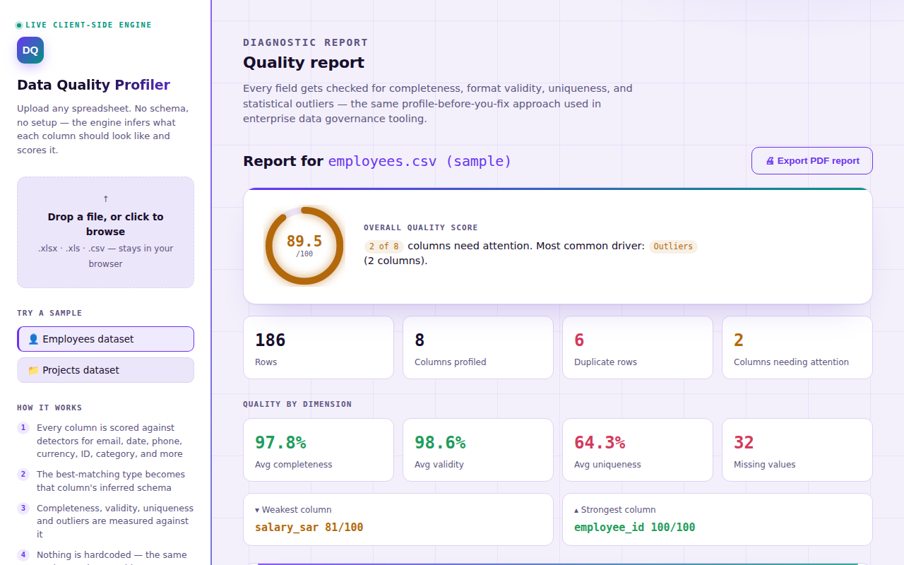

# 🔍 Data Quality Profiler

**Upload any spreadsheet. Get an instant, per-column data quality report — with zero configuration.**

[](https://github.com/omaralthunaiyan-cloud/data-quality-profiler/actions/workflows/ci.yml)
[](LICENSE)
[](requirements.txt)

**🌐 [Try the live, zero-install demo →](https://omaralthunaiyan-cloud.github.io/data-quality-profiler/)** — same engine, ported to vanilla JS, runs entirely in your browser. Nothing to install, nothing uploaded anywhere. It even exports a formatted PDF report.

No schema. No column mapping. No "tell me what this file contains" step. Point it at an HR export, a project tracker, a sales ledger — anything with rows and columns — and it infers what each column *should* look like, then tells you exactly where the data breaks that pattern. Workbooks with multiple sheets get a sheet picker automatically — pick one, get its report, switch sheets without re-uploading.

> Built as a hands-on extension of the data profiling, quality assessment, and metadata governance work I do as a Data & Intelligence Co-op at Devoteam (Informatica CDQ/IDMC, NDMO/PDPL compliance). This project reimplements the same idea — profile first, quantify the problem, then remediate — as a general-purpose, schema-agnostic tool.



---

## Why this is different from a one-off "clean my CSV" script

Most data-cleaning scripts are written for *one* file: they know the column is called `email`, they know `salary` should be positive. This tool knows none of that in advance. It looks at the *values themselves* and works out the semantic type of each column from scratch, using a bank of pattern detectors (email, date, phone number, Saudi national ID, currency, percentage, boolean, categorical, free text, ...). Whichever detector explains the highest share of a column's values wins — and the leftover share becomes the quality problem reported back to you.

That's the same principle behind enterprise tools like Informatica CDQ or Great Expectations, built from first principles in pure Python + pandas.

## What it checks, per column

| Dimension | What it measures |
|---|---|
| **Inferred type** | The best-matching semantic type (email, date, integer, currency, categorical, etc.) and the model's confidence in that guess |
| **Completeness** | % of non-missing values |
| **Validity** | % of values that actually conform to the inferred type's pattern |
| **Uniqueness** | % of distinct values (flags near-constant or ID-like columns) |
| **Outliers** | Statistical outliers in numeric columns via the IQR method |
| **Quality score** | A single 0–100 score per column, weighted toward completeness and validity, penalized for outliers and structural noise |

Dataset-level, it also rolls every column into a set of headline KPIs — average completeness/validity/uniqueness across the whole file, total missing values, the weakest and strongest column, and which single dimension is the leading cause of quality loss (with a root-cause breakdown chart) — so you get a verdict in one glance, not just a wall of per-column numbers.

## Try it in 60 seconds

**Option A — zero install:** open the **[live demo](https://omaralthunaiyan-cloud.github.io/data-quality-profiler/)**, click a sample dataset (or drop in your own file), done.

**Option B — run the Python/Streamlit version locally:**

```bash
git clone https://github.com/omaralthunaiyan-cloud/data-quality-profiler.git
cd data-quality-profiler
pip install -r requirements.txt
streamlit run app/streamlit_app.py
```

The app opens with two ready-made sample datasets in the sidebar — `employees.xlsx` and `projects.xlsx` — both deliberately seeded with realistic messiness (broken emails, inconsistent date formats, negative salaries, duplicate rows, invalid IDs) so you can see the profiler catch real problems immediately. Or just drag in your own `.xlsx`/`.csv`.

## Architecture

```
data-quality-profiler/
├── src/
│   ├── type_inference.py   # column -> semantic type, via ~10 pattern detectors
│   └── profiler.py         # completeness / validity / uniqueness / outliers / scoring
├── app/
│   └── streamlit_app.py    # interactive UI: upload, visualize, export report
├── web/                    # source for the vanilla-JS live demo (second engine)
│   ├── shell.html          # page layout + CSS (light/dark theme)
│   ├── ui.js                # app logic: load, profile, render, CSV/PDF export
│   ├── app.js               # small shared helpers
│   ├── vendor/xlsx.mini.min.js  # SheetJS, parses .xlsx/.xls client-side
│   ├── examples/*.csv       # sample datasets, embedded into the built page
│   ├── build.py             # assembles the above into artifact.html
│   └── artifact.html        # pre-built, single-file standalone output
├── docs/
│   └── index.html          # GitHub Pages copy of web/artifact.html — this is what's live
├── examples/
│   ├── generate_examples.py
│   ├── employees.xlsx      # sample dataset #1 (HR-flavored)
│   └── projects.xlsx       # sample dataset #2 (project-tracker-flavored)
├── tests/
│   ├── test_type_inference.py
│   └── test_profiler.py
├── .streamlit/config.toml  # theme, matches the live demo's palette
└── .github/workflows/ci.yml
```

The type-inference and profiling engine (`src/`) has **no dependency on the UI** and no dependency on any specific column name — it's a plain function of a pandas DataFrame in, a structured report out. That's what makes it reusable: the same `profile_dataset()` call works whether you feed it payroll data or a shipping manifest.

## Two implementations, one engine

This repo ships the original Python/pandas implementation, with a full test suite and CI. The [live demo](https://omaralthunaiyan-cloud.github.io/data-quality-profiler/) (source in `web/`) is a from-scratch port of the same detectors and scoring rules to dependency-free vanilla JavaScript, so it can run entirely client-side with no server and no install — including a one-click, print-ready PDF export. Porting the same logic to a second language and getting matching scores on both sample datasets (89.5/100 and 95.0/100) was itself a useful correctness check on the scoring rules.

## How type inference works

For each column, every detector returns a **match rate** (0–1), not a boolean — a column that's "90% clean emails, 10% garbage" is still correctly typed as `email`, and that 10% becomes the validity problem the report surfaces, rather than a reason to give up and call the whole column free text.

```python
DETECTORS = {
    "email":       ...,  # regex + must contain exactly one @ and a valid TLD
    "date":        ...,  # tried against ~9 common date formats (ISO, DD/MM/YYYY, ...)
    "saudi_id":    ...,  # 10-digit, starts with 1 or 2 (Saudi national ID / Iqama)
    "phone":       ...,  # digit/format pattern, explicitly excludes date-shaped strings
    "currency":    ...,  # numeric with optional SAR/USD/ر.س suffix
    "categorical": ...,  # low cardinality relative to row count, short average length
    "free_text":   ...,  # low-confidence fallback, always available
    # + boolean, percent, url, integer, float
}
```

Column-name hints are deliberately **not** used to break ties — the engine has to earn the classification from the data alone, which is what makes it generalize to files it's never seen.

## Known limitations (and what I'd add next)

- Type inference is heuristic, not learned — an edge case I'm proud of catching (ISO dates no longer misclassified as phone numbers) came from testing against the sample data, which is exactly the kind of validation this project is meant to encourage.
- Multi-sheet workbooks are supported (both apps show a sheet picker and profile one sheet at a time), but there's no cross-sheet analysis yet — e.g. no automatic check that a `department` column in one sheet matches the values in another.
- No column-level custom rules yet (e.g. "this integer column must be between 1 and 5").
- The IQR outlier method is intentionally simple; a production version would let you swap in z-score or isolation-forest based detection per column.
- No persistence layer yet — every run is stateless. A logical next step is a run history so quality trends over time become visible (did this month's Q3 export get worse than August's?).

## Tech stack

Python · pandas · NumPy · Streamlit · Plotly · pytest · GitHub Actions

## Author

**Omar Althunaiyan** — Information Systems graduate, King Saud University · Data & Intelligence Co-op, Devoteam
[LinkedIn](https://www.linkedin.com/in/omar-althunaiyan-a43933385)
